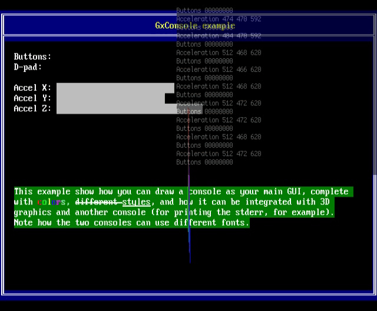

# GX console library

Add a way to render text sent to stdout and/or stderr, even in graphical applications.

GxConsole renders a VT console into a 16bpp texture, making it easy to use it
even in graphical 3D applications.

## Build instructions

    cmake -DCMAKE_TOOLCHAIN_FILE=/opt/devkitpro/cmake/Wii.cmake -DBUILD_EXAMPLE=ON -B _wii -S .
    cmake --build _wii
